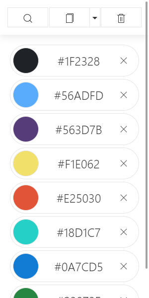
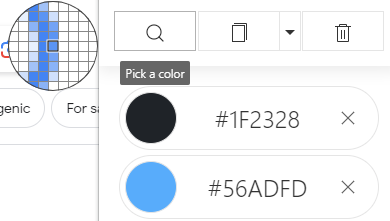
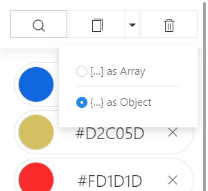
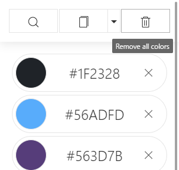

# Colorpad

**Simple color picker Chrome Extension**
<!--  -->

Colors are stored in Local storage.



## Installation

1. In Chrome browser enable "Developer mode" in "More tools" > "Extensions" by toggling the switch on the top right corner of the page. 
2. Click on "Load unpacked" button.
3. Select the folder containing this extension and click on "Select Folder".

## Color picker
EyeDropper API is used to pick a color.



## Copy to clipboard
Individual color code or batch export as Array or Object to clipboard.




```javascript
[
  "#ffffff",
  "#1f2328",
  "#56adfd",
  "#563d7b",
  "#f1e062",
  ...
]
```
```javascript
{
  "1f2328": "#1f2328",
  "56adfd": "#56adfd",
  "563d7b": "#563d7b",
  "f1e062": "#f1e062",
  ...
}
```
## Clear all
Remove all colors colors


