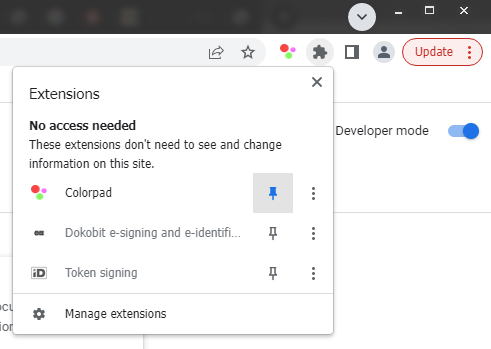
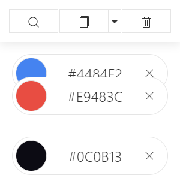

# Colorpad

**Simple color picker Chrome Extension**

All colors are stored in Local storage for later usage.


## Installation



1. In Chrome browser enable "Developer mode" in "More tools" > "Extensions" by toggling the switch on the top right corner of the page. 
2. Click on "Load unpacked" button.
3. Select the folder containing this extension and click on "Select Folder".
4. Pin an extension to your toolbar, by clicking the Extensions Menu icon next to your profile avatar. Each extension listed will have a pushpin icon to the right of it. 

## Color picker
EyeDropper API is used to pick a color.


## Sorting
Drap & drop sorting colors is available



## Copy to clipboard
Export to clipboard individual color code or batch export as Array / Object.


JavaScript Array:
```javascript
[
  "#ffffff",
  "#1f2328",
  "#56adfd",
  "#563d7b",
  "#f1e062",
  ...
]
```
JavaScript Object:
```javascript
{
  "1f2328": "#1f2328",
  "56adfd": "#56adfd",
  "563d7b": "#563d7b",
  "f1e062": "#f1e062",
  ...
}
```